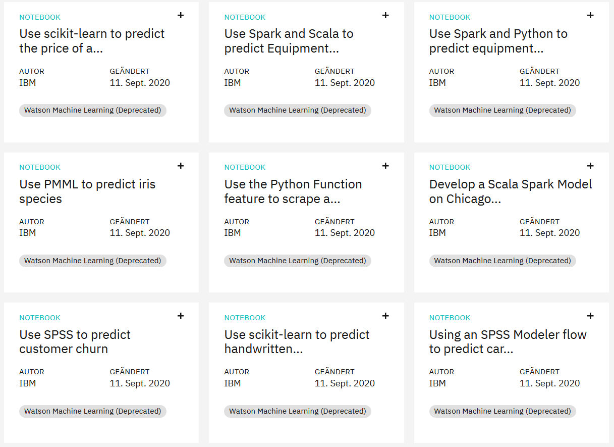

# Recommendations with IBM

This is another project from Udacity's Data Science Nanodegree programme.
The task is to develop recommendation engines for the users of the IBM Watson Community which suggest new articles.

## Introduction
This project focuses on analysing interactions between users and articles on the IBM Watson Studio platform. Based on the users' interactions, new item recommendations are issued to them. 
On the basis of the data provided, various methods can be used to make these recommendations. The methods used here are Rank Based, Collaborative Filtering and Matrix Factorisation.

## Rank Based Recommendations
Since there are no ratings for items, the most popular items are represented by their interactions with users.
It is only known whether the user has interacted with an item or not.
It can simply count how many times an article has been interacted with by users and proclaim it as the most popular.
This recommendation system is particularly useful for making recommendations to new users for whom we have no data.

## User-User Collaborative Filtering

Finding similar users based on item interactions usually leads to better and more personalised recommendations.
The first step is to create a user-article matrix where each row is assigned a unique user and each column is assigned a unique article.
Each interaction is represented by a 1 which results in the creation of a sparse matrix.
 Similarity refers to a pair of users reading same articles.
This identifies similar users. The articles they have read are extracted and unique articles are recommended that have been seen by one user but not the other.
Content-based recommendations were performed based on Natural Language Processing (NLP) methods. The text similarity of the article titles was calculated using CountVectorizer as the dot product of the text vectors for each title. 

## Matrix Factorization

The user element matrix can be used again to make recommendations by performing a singular value decomposition (SVD).
Using this method allows for predicting the user-article interaction.By breaking down the user-item matrix into a product of three matrices we can extract latent features (Sigma matrix) which indicate some relationship between the user and article. Predictions are made by varying the amount of latent features we choose to keep.

## Installations:

Required libraries:

+ Numpy
+ Pandas
+ Matplotlib
+ pickle

Please run `pip install -r requirements.txt`

## Project Motivation: 
My aim in this project was to develop concepts for recommending articles.
